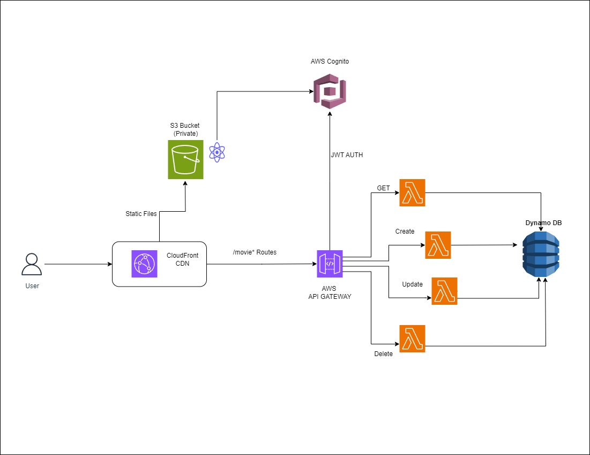

# 🎬 Movie Catalog CRUD App — AWS Serverless

A modern, fully serverless Movie Catalog web app where users can securely sign in, browse, add, edit, and delete movie records.  
Adapted from the popular AWS Coffee Shop CRUD tutorial, reimagined with a new domain, improved styling, and a completely new dataset.

**🌐 Live Demo:** [https://www.free-project.online](https://www.free-project.online)

---

## 🏗️ Architecture



- **Frontend:** React SPA (Vite, custom CSS)  
- **API:** AWS API Gateway (Secured by Cognito JWT authorizer)
- **Backend:** AWS Lambda Functions (Node.js)  
- **Shared Layer:** Lambda Layer with DynamoDB helper logic  
- **Database:** DynamoDB (`MoviesTable`)
- **Authentication:** Amazon Cognito (OIDC login, JWTs)
- **Hosting:** S3 (static site) + CloudFront (global CDN, HTTPS) + custom domain

---

## ✨ Features

- User sign-up/sign-in with Cognito (fully managed, secure)
- Browse, add, edit, and delete **movie** records
- Responsive gallery UI with modern navigation
- Secure API endpoints (only logged-in users can use the backend)
- Serverless, scalable, and pay-as-you-go (AWS Free Tier friendly)

---

## 🛠️ Technologies Used

- [React](https://react.dev/) (frontend SPA)
- [Vite](https://vitejs.dev/) (build tool)
- [Amazon Cognito](https://aws.amazon.com/cognito/) (auth)
- [API Gateway](https://aws.amazon.com/api-gateway/) (REST API)
- [AWS Lambda](https://aws.amazon.com/lambda/) (backend, Node.js)
- [Lambda Layer](https://docs.aws.amazon.com/lambda/latest/dg/configuration-layers.html) (shared DB helpers)
- [DynamoDB](https://aws.amazon.com/dynamodb/) (NoSQL movie storage)
- [S3](https://aws.amazon.com/s3/) + [CloudFront](https://aws.amazon.com/cloudfront/) (static hosting, CDN)
- [Custom Domain](https://www.free-project.online) via 3rd-party registrar

---

## 🗂️ Project Structure
```
aws-serverless-app/
   -frontend/
        -src/
             -NavBar.jsx
             -App.jsx
             -AddMovieForm.jsx
             -ItemDetails.jsx
             -utils/apis.js
        -App.css
        -index.css
        -main.jsx
   -LambdaWithLayer/
        -nodejs/utils.mjs
    -lambda/
            -get.js
            -post.js
            -update.js
            -delete.js
    -.gitignore
    -README.md
```

---

## 🚀 Getting Started

### 1. Clone & Install

```bash
git clone https://github.com/<your-username>/<repo>.git
cd aws-serverless-app/frontend
npm install
```
### 2. Local Developement

Copy .env.example to .env and set your API endpoint:

```bash

cp .env.example .env

```

Edit `.env:`

```ini

VITE_API_URL=https://<your-api-id>.execute-api.<region>.amazonaws.com
```
Start local dev server:

```bash

npm run dev

```

### 3. Production Deploy
Build & upload the static frontend:

```bash
cd frontend
npm run build
aws s3 sync dist/ s3://<your-s3-bucket> --delete
```
Then, in CloudFront, invalidate cache for latest changes:

```
/*
```

### Access your site:

https://www.free-project.online

## 🌍 API Endpoints
| Route                        | Method | Description      |
| ---------------------------- | ------ | ---------------- |
| `/movie`                     | GET    | List all movies  |
| `/movie/:id`                 | GET    | Get single movie |
| `/movie`                     | POST   | Add new movie    |
| `/movie/:id`                 | PUT    | Update movie     |
| `/movie/:id`                 | DELETE | Delete movie     |


(All routes require Cognito JWT token, handled by the frontend automatically)

### 🧩 Architecture Summary
```
React → CloudFront/S3 → API Gateway (Cognito Auth) → Lambda (w/ Layer) → DynamoDB
```
All serverless, scalable, and cost-effective.

